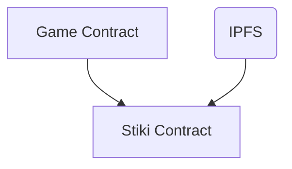

# STIKI



## Dependencies

- Protostar

    ```bash
    curl -L https://raw.githubusercontent.com/software-mansion/protostar/master/install.sh | bash
    ```

- Open Zeppelin Contracts

    ```bash
    protostar install https://github.com/OpenZeppelin/cairo-contracts
    ```
## Build

```bash
make build
```

## Test

```bash
make test
```
