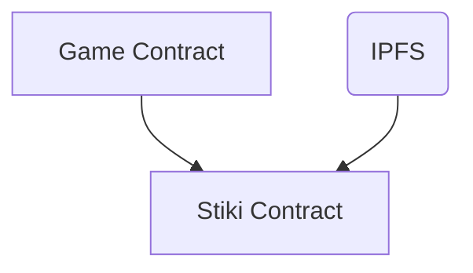

# STIKI

An unfinished attempt at an on-chain game wiki on starknet that rewards players in-game for their scholarship, with reward proportional to their contribution to the version of the page being upvoted. (includes WIP implementation of wiki contract and an (inefficient) implementation of an edit distance algorithm, and word tokenizer (sort of).



## Dependencies

- Protostar

    ```bash
    curl -L https://raw.githubusercontent.com/software-mansion/protostar/master/install.sh | bash
    ```

- Open Zeppelin Contracts

    ```bash
    protostar install https://github.com/OpenZeppelin/cairo-contracts
    ```

## Build

```bash
make build
```

## Test

```bash
make test
```

## Deploy

```bash
export PKEYADMIN=<priv_key>
nile setup "PKEYADMIN" --network goerli 
make deploy
```
